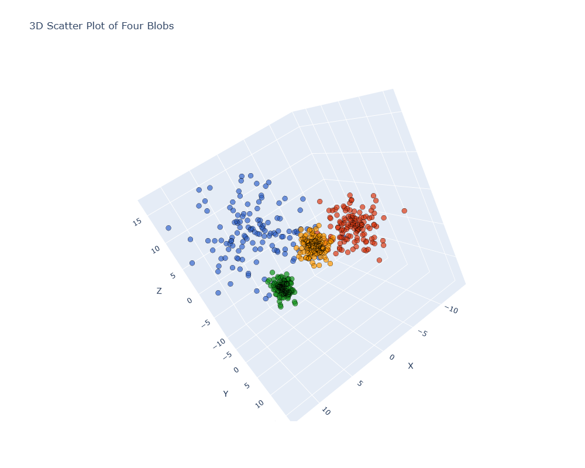
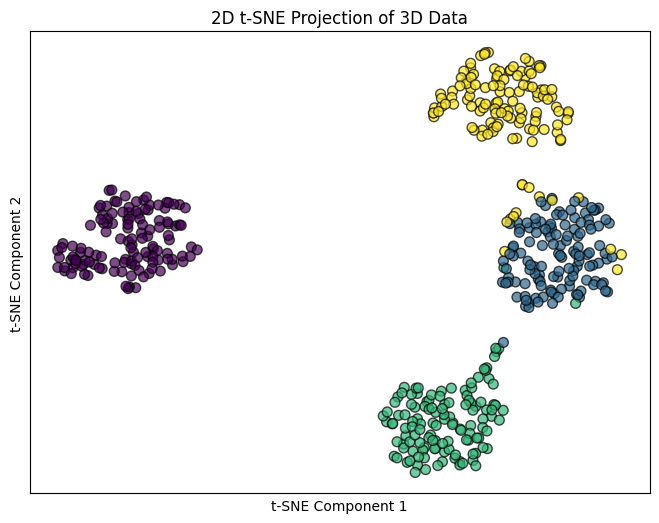
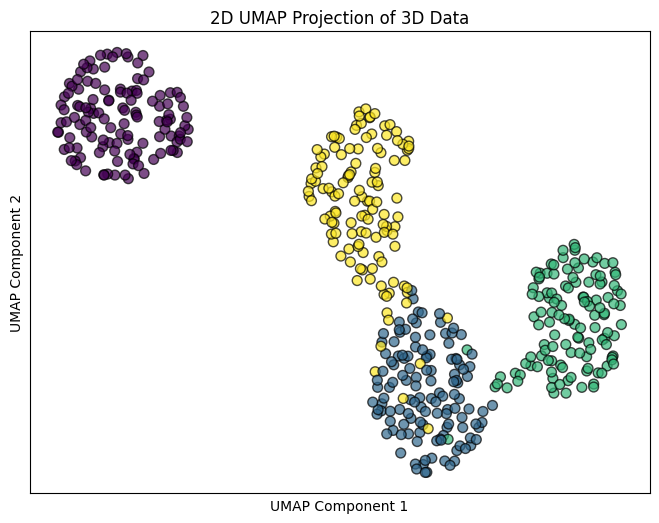
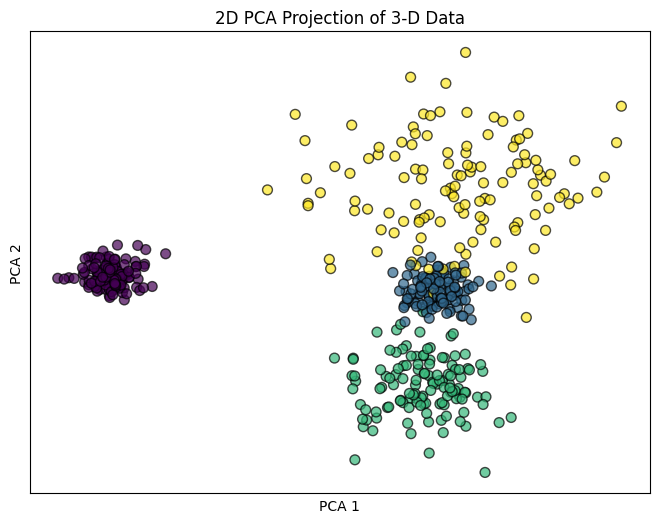

# Dimensionality Reduction Algorithms, tSNE and UMAP, on Synthetic Data

This project generates synthetic 3D data with four clusters and compares three dimensionality reduction methods:

- PCA
- t-SNE
- UMAP

The goal is to visualize how different methods represent the same 3D clustered structure after reducing it to 2D, and to compare what each method preserves.

---


### Dimensionality reduction algorithms, tSNE and UMAP, on synthetic data

The four blobs have various density.

The distance between the blobs is consistent with the degree to which they were originally separated

PCA preserved the relative blob densities.<br>
PCA and t-SNE took little time to complete compared to UMAP.

---

## Project Overview

The notebook generates synthetic clustered data in a 3D space using `make_blobs`, scales the data, and applies:

- **PCA** for linear dimensionality reduction
- **t-SNE** for nonlinear neighborhood-preserving embedding
- **UMAP** for nonlinear manifold-based embedding

It also visualizes the original dataset in 3D so the reduced 2D plots can be compared with the true structure.

---

## Repository Contents

This repository includes:

- `tSNE-and-UMAP.ipynb`
- `3D.png`
- `2D-tSNE.png`
- `2D-UMAP.png`
- `2D-PCA.png`

---

## Installation

Use the following package installation commands:

```python
!python -m pip install numpy==2.2.0
!python -m pip install pandas==2.2.3
!python -m pip install matplotlib==3.9.3
!python -m pip install plotly==5.24.1
!python -m pip install --upgrade scikit-learn umap-learn
```

Main libraries used in the project:

- `numpy`
- `pandas`
- `matplotlib`
- `plotly`
- `scikit-learn`
- `umap-learn`

---

## Synthetic Data Generation

The dataset is generated using `sklearn.datasets.make_blobs`.

### Cluster Centers

The code uses four 3D cluster centers:

- `[2, -6, -6]`
- `[-1, 9, 4]`
- `[-8, 7, 2]`
- `[4, 7, 9]`

### Cluster Standard Deviations

The code uses:

`cluster_std = [1, 1, 2, 3.5]`

This means each cluster has its own spread around its center.

- A smaller standard deviation means a tighter and denser cluster.
- A larger standard deviation means a more spread-out cluster.

So in this dataset:

- the first cluster is compact
- the second cluster is compact
- the third cluster is more spread out
- the fourth cluster is the most spread out

This matches the notebook statement:

The four blobs have various density.

### Shape of the Dataset

The dataset is generated with:

- `n_samples = 500`
- `n_features = 3`

So the matrix `X` has shape:

`(500, 3)`

Each row is one data point in 3D.

The output labels identify the true cluster membership of each point.

---

## Data Preprocessing

Before dimensionality reduction, the features are standardized using `StandardScaler`.

### Standardization Formula

For a feature value `x`, the standardized value is:

`z = (x - mu) / sigma`

where:

- `mu` is the mean of the feature
- `sigma` is the standard deviation of the feature

### Why Standardization Is Important

Standardization ensures that all features contribute on a comparable scale.

Without scaling, a feature with a larger numerical range could dominate:

- variance calculations in PCA
- distance calculations in t-SNE
- neighborhood relationships in UMAP

After scaling, each feature has approximately:

- mean `0`
- standard deviation `1`

---

## Methods Used

## PCA

### General Purpose

PCA, or Principal Component Analysis, is a linear dimensionality reduction method.

It is commonly used to:

- reduce dimensionality
- compress data
- remove redundancy
- visualize major directions of variation
- build a simple baseline before nonlinear methods

### Plain Math Behind PCA

Suppose the standardized data matrix is `X` with shape `n x d`, where:

- `n` is the number of samples
- `d` is the number of features

PCA is based on the covariance matrix:

`Sigma = (1 / (n - 1)) X^T X`

PCA finds eigenvalues and eigenvectors of `Sigma`.

- Eigenvectors define directions in feature space.
- Eigenvalues measure how much variance lies along those directions.

The first principal component is the unit vector `w_1` that maximizes:

`Var(X w_1)`

subject to:

`||w_1|| = 1`

The second principal component is the next best orthogonal direction, and so on.

If the data is reduced to 2D, each point `x` is projected onto the first two principal components:

`x_reduced = [x · w_1, x · w_2]`

### What PCA Preserves

PCA mainly preserves:

- large-scale variance structure
- linear relationships
- relative spread of the data

It does not explicitly preserve local neighborhood structure in a nonlinear sense.

### Why PCA Is Used Here

PCA gives a fast and interpretable linear baseline. Since the original data already lives in 3D, PCA shows how much of the original structure can be captured by a simple 2D projection.

This is consistent with the notebook statement:

PCA preserved the relative blob densities.<br>
PCA and t-SNE took little time to complete compared to UMAP.

---

## t-SNE

### General Purpose

t-SNE, or t-distributed Stochastic Neighbor Embedding, is a nonlinear dimensionality reduction method mainly used for visualization.

It is especially useful for:

- visualizing clusters
- preserving local neighborhoods
- exploring structure in high-dimensional data

### Plain Math Idea Behind t-SNE

t-SNE converts similarities in the original space into probabilities.

For points `x_i` and `x_j`, it defines a Gaussian-based conditional probability:

`p_{j|i} = exp(-||x_i - x_j||^2 / (2 sigma_i^2)) / sum_{k != i} exp(-||x_i - x_k||^2 / (2 sigma_i^2))`

These are symmetrized into:

`p_{ij} = (p_{j|i} + p_{i|j}) / (2n)`

In the low-dimensional space, for embedded points `y_i` and `y_j`, t-SNE defines:

`q_{ij} = (1 + ||y_i - y_j||^2)^(-1) / sum_{k != l} (1 + ||y_k - y_l||^2)^(-1)`

Then t-SNE minimizes the Kullback-Leibler divergence:

`KL(P || Q) = sum_{i != j} p_{ij} log(p_{ij} / q_{ij})`

This makes nearby points in the original space stay nearby in the embedding.

### Why the t-distribution Is Used

The heavy tails of the Student t-distribution help reduce crowding and make separated groups more visible in 2D.

### Important Interpretation Note

t-SNE is very strong for preserving local neighborhoods, but global distances between clusters should be interpreted carefully.

Even so, for this dataset, the notebook notes:

The distance between the blobs is consistent with the degree to which they were originally separated

That is a reasonable visual observation for this specific synthetic example.

### Parameters Used

The notebook uses:

- `n_components = 2`
- `perplexity = 30`
- `max_iter = 1000`
- `random_state = 42`

### Meaning of Perplexity

Perplexity controls the effective neighborhood size.

- smaller perplexity focuses more on very local neighborhoods
- larger perplexity considers a wider neighborhood structure

---

## UMAP

### General Purpose

UMAP, or Uniform Manifold Approximation and Projection, is a nonlinear dimensionality reduction method used for:

- visualization
- manifold learning
- preserving local structure
- capturing useful topological organization

### Plain Math Intuition Behind UMAP

UMAP builds a weighted graph representing neighborhood relationships in the original space.

Then it finds a low-dimensional embedding whose graph structure is as consistent as possible with the original one.

In simple terms, UMAP tries to:

- keep nearby points close
- avoid collapsing unrelated points together
- preserve meaningful local and some broader structural information

Unlike PCA, it is not based on variance maximization. Unlike t-SNE, it is not only matching pairwise probabilities. It is built from graph and manifold ideas.

### Parameters Used

The notebook uses:

- `n_components = 2`
- `random_state = 42`
- `min_dist = 0.5`
- `spread = 1`
- `n_jobs = 1`

### Meaning of `min_dist`

`min_dist` controls how tightly points can be packed together in the low-dimensional embedding.

- smaller `min_dist` gives tighter clusters
- larger `min_dist` gives more spread inside clusters

### Why UMAP Is Used Here

UMAP provides a second nonlinear embedding method so the project can compare how different nonlinear methods display the same clustered structure.

---

## Technical Workflow

## 1. Install dependencies

The notebook installs the required libraries for numerical computation, plotting, and dimensionality reduction.

## 2. Import libraries

The code imports tools from:

- `numpy`
- `pandas`
- `matplotlib`
- `plotly`
- `sklearn.datasets`
- `sklearn.preprocessing`
- `sklearn.decomposition`
- `sklearn.manifold`
- `umap`

## 3. Generate 3D synthetic data

The notebook defines:

- four cluster centers
- four cluster standard deviations

Then it calls `make_blobs(...)` to create:

- `X`, the 3D points
- `labels_`, the ground-truth cluster labels

## 4. Build a DataFrame

A DataFrame is created with coordinate columns for plotting the original 3D data.

## 5. Plot the original 3D data

The notebook uses Plotly to create an interactive 3D scatter plot of the original four blobs.

## 6. Scale the data

The data is standardized using `StandardScaler`.

## 7. Apply t-SNE

The scaled data is reduced from 3D to 2D using t-SNE.

## 8. Plot the t-SNE embedding

A 2D scatter plot is created to show the t-SNE representation.

## 9. Apply UMAP

The scaled data is reduced from 3D to 2D using UMAP.

## 10. Plot the UMAP embedding

A 2D scatter plot is created to show the UMAP representation.

## 11. Apply PCA

The scaled data is projected from 3D to 2D using PCA.

## 12. Plot the PCA projection

A 2D scatter plot is created to show the PCA representation.

---

## Figures and Analysis

## Original 3D Data



This figure shows the original synthetic dataset in 3D.

Analysis:

- The four clusters are clearly separated in space.
- Their densities are visibly different.
- The visual spread matches the chosen `cluster_std` values.
- This is the reference structure against which the 2D methods should be compared.

---

## 2D t-SNE Projection



Analysis:

- The four clusters remain clearly separated.
- Local within-cluster grouping is strong.
- The layout emphasizes neighborhood preservation.
- The separation between groups is visually strong and easy to interpret.

This matches the notebook statement:

The distance between the blobs is consistent with the degree to which they were originally separated

For this dataset, t-SNE gives a very clean visual separation of the blobs.

---

## 2D UMAP Projection



Analysis:

- UMAP also separates the four groups clearly.
- The cluster shapes are visible.
- The relative arrangement differs from t-SNE because UMAP optimizes a different objective.
- The result is visually clean and preserves local grouping well.

UMAP provides a useful nonlinear alternative to t-SNE and often reveals structure with a different geometric layout.

---

## 2D PCA Projection



Analysis:

- PCA still separates most clusters well despite being a linear method.
- It preserves relative spread and density information naturally.
- Some geometric compression is expected because 3D data is being linearly projected into 2D.
- It serves as a strong baseline for comparison with nonlinear methods.

This agrees with the notebook conclusion:

PCA preserved the relative blob densities.<br>
PCA and t-SNE took little time to complete compared to UMAP.

---

## Comparison of the Methods

### PCA

**Best for:**

- fast baseline dimensionality reduction
- variance-based summaries
- interpretable linear projection

**Strengths:**

- simple
- fast
- mathematically transparent

**Limitations:**

- only linear
- may not preserve nonlinear structure

### t-SNE

**Best for:**

- cluster visualization
- preserving local neighborhoods
- exploratory analysis

**Strengths:**

- excellent visual separation
- strong local structure preservation

**Limitations:**

- global distances can be misleading
- sensitive to parameter choices
- axes are not directly interpretable

### UMAP

**Best for:**

- nonlinear visualization
- manifold-style structure discovery
- preserving local relationships with useful global organization

**Strengths:**

- flexible
- visually strong
- effective for structured datasets

**Limitations:**

- still nonlinear
- geometry depends on parameter choices
- axes are not directly interpretable in the original feature sense

---

## Main Takeaways

This notebook shows that:

1. synthetic clustered 3D data can be generated with controlled density and separation
2. standardization is an important preprocessing step
3. PCA, t-SNE, and UMAP solve different mathematical problems
4. PCA preserves variance structure
5. t-SNE preserves local neighborhood similarity
6. UMAP preserves graph-based neighborhood structure with manifold intuition
7. visual conclusions should always be compared against the original data

---

## How to Reproduce

1. Install the required packages.
2. Run the notebook in order.
3. Generate the synthetic 3D data.
4. Standardize the features.
5. Apply PCA, t-SNE, and UMAP.
6. Save the resulting images as:

- `3D.png`
- `2D-tSNE.png`
- `2D-UMAP.png`
- `2D-PCA.png`

---

## Conclusion

This project compares PCA, t-SNE, and UMAP on synthetic 3D clustered data with four blobs of different densities.

The results show that:

- the original 3D structure contains clearly separated groups
- PCA provides a strong linear baseline
- t-SNE produces a very clear neighborhood-based cluster map
- UMAP gives a strong nonlinear embedding with clean separation

Together, the notebook and the figures provide a useful side-by-side demonstration of how different dimensionality reduction algorithms behave on the same dataset.
